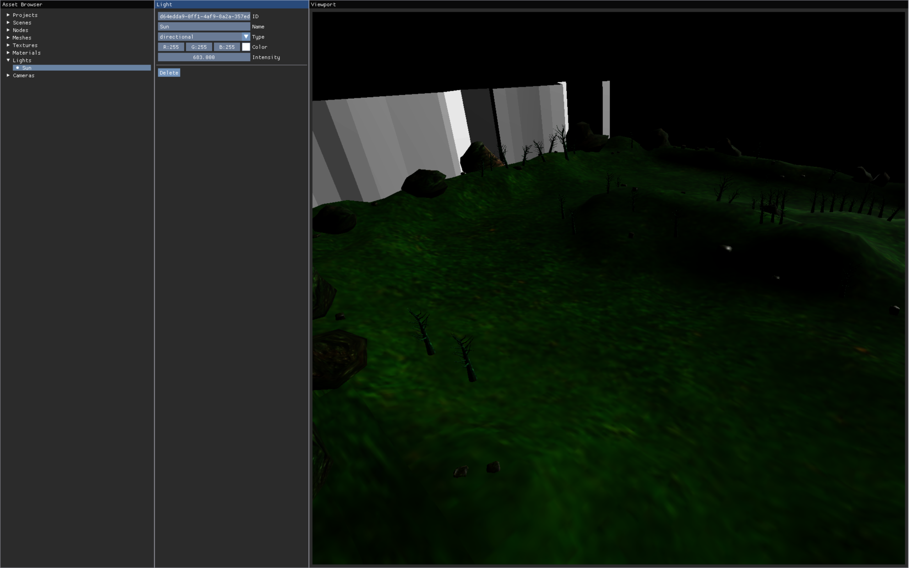

# Zenbuforge Level
**Everything in this project is subject to change.**

The editor is hosted on GitHub Pages: https://kupoman.github.io/zenbuforge/

Zenbuforge Level is a local-fist collaborative 3D level editor.
Project data is stored locally in your browser.
It is based on the glTF format and is designed to allow users to create 3D levels together for any game engine that supports glTF import.



This project is still in its very early stages and is not intended for anything close to a production work flow.
A few examples of things that need to be resolved before being production ready:
* Undo/redo
* Data migration between versions
* More thorough QA to reduce data loss risk and improve reliability

## Viewport controls
* Q: Move camera down
* E: Move camera up
* W: Move camera forward
* A: Move camera left
* S: Move camera backward
* D: Move camera right
* Arrow Keys: Rotate camera
* Left Mouse: Select object
* Right Mouse: Rotate camera

## Real time collaboration
Real time collaboration is done using [WebRTC](https://en.wikipedia.org/wiki/WebRTC) and [Yjs](https://yjs.dev/) ([conflict-free replicated data types](https://en.wikipedia.org/wiki/Conflict-free_replicated_data_type)).
In order to connect peers to each other, a signaling server is needed.
Once peers are connected, they send data to each other directly.
This means your project id and IP address are the only data that passes through the signaling server.

### Sharing a project
In order to connect to your project, another user will need your project ID.
This can be found by selecting your project in the Asset Browser.

### Connect to a project
To connect to a project, start by selecting the "Projects" header in the Asset Browser.
Then click the "Add Remote" button in the Projects panel that appears.
You will need to pieces of information to connect to the remote project.
First is the project ID.
See the [Sharing a project](#sharing-a-project) section for details on how to find this ID.
Second, you will need a signaling server to help you connect to other peers.
A public signaling server is available for use with this project.
To use it, specify a server value of `wss://signal.zenbuforge.com`.
See the [Self hosting](#self-hosting) section if you wish to use a private signaling server.

### NAT traversal
A Google STUN server is in use to help client connect across NATs.
No TURN server is in use at this time.
That means users on networks that cannot be traversed with STUN will be unable to connect to other users.

## Self hosting
### Editor client
To host the editor client yourself, follow the steps below.
1. Clone this repository
```bash
git clone https://github.com/Kupoman/zenbuforge.git
```
2. Install dependencies
```bash
npm install
```
3. Run [Vite](https://vitejs.dev/) to host the client (this step may require customization depending on your use case)
```
npx vite
```
### Signaling server
To run your own signaling server, follow the steps below.
1. Clone this y-webrtc fork (fork adds HTTPS/WSS support)
```bash
git clone https://github.com/Kupoman/y-webrtc.git
```
2. Install dependencies
```bash
npm install
```
3. Run the server
```
CERT=fullchain.pem KEY=privkey.pem PORT=8443 bin/server.js
```
